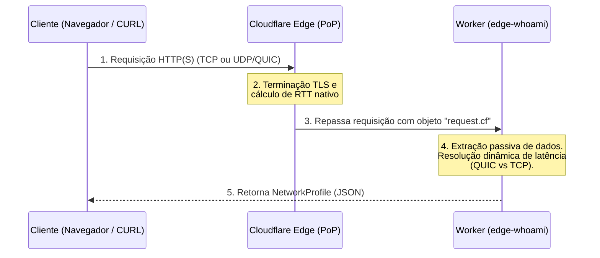

# Edge Network Identity (edge-whoami)

Uma API de observabilidade de rede extremamente rápida e *stateless*, executada inteiramente na borda (Edge) através do **Cloudflare Workers**. 

Este projeto foi desenhado utilizando princípios de **Clean Architecture** e **YAGNI** (You Aren't Gonna Need It). Em vez de realizar verificações ativas ou varreduras (ping/port scans), a aplicação atua de forma passiva: ela intercepta a requisição do cliente e extrai metadados valiosos já injetados pela infraestrutura de borda da Cloudflare (`request.cf` e cabeçalhos HTTP).

## 🚀 Funcionalidades

A API retorna um perfil de rede completo em formato JSON contendo:

* **Identidade Base:** Endereço IP público (IPv4/IPv6).
* **Provedor de Infraestrutura:** Identificação do ISP e número ASN.
* **Geolocalização:** País, estado, cidade, código postal e coordenadas (Latitude/Longitude).
* **Métricas de Conexão:** * Datacenter da Cloudflare que atendeu a requisição (ex: `GRU`, `MIA`).
  * Protocolo utilizado (HTTP/2, HTTP/3).
  * Versão do TLS.
  * **Latência Nativa (RTT):** O tempo de ida e volta (Round Trip Time) medido dinamicamente durante o *handshake* da conexão, suportando protocolos modernos (QUIC) e legado (TCP).

## 📐 Arquitetura e Fluxo de Dados

A extração de dados ocorre em milissegundos sem qualquer processamento pesado, dependência de banco de dados ou chamadas externas de API.



## 📦 Exemplo de Payload (Response)

O contrato de resposta da API é estritamente tipado e estruturado por domínios (`provider`, `location`, `connection`, `client`):

```json
{
  "ip": "186.192.230.19",
  "provider": {
    "isp": "RLINE TELECOM LTDA",
    "asn": 28145
  },
  "location": {
    "city": "Planalto",
    "region": "PR",
    "country": "BR",
    "postalCode": "85750-000",
    "latitude": "-25.71611",
    "longitude": "-53.76611",
    "timezone": "America/Sao_Paulo"
  },
  "connection": {
    "datacenter": "GRU",
    "latencyMs": 24,
    "protocol": "HTTP/3",
    "tlsVersion": "TLSv1.3"
  },
  "client": {
    "userAgent": "Mozilla/5.0 (Linux; Android 10...) AppleWebKit/537.36...",
    "platform": "Android"
  }
}
```

## 🛠️ Stack Tecnológica

* **Linguagem:** TypeScript (Strict Mode)
* **Plataforma:** Cloudflare Workers
* **Tooling:** Wrangler CLI

## 💻 Desenvolvimento Local

Para rodar o projeto localmente:

1. Clone o repositório:
   ```bash
   git clone https://github.com/seu-usuario/edge-network-identity.git
   cd edge-network-identity
   ```

2. Instale as dependências (Tipos da Cloudflare):
   ```bash
   npm install
   ```

3. Inicie o servidor de desenvolvimento:
   ```bash
   npx wrangler dev
   ```
   *Nota: No ambiente local, dados geográficos e de latência gerados pela infraestrutura da Cloudflare podem vir vazios ou com dados de mock do Wrangler.*

## 🚀 Deploy

Para publicar a API diretamente na rede Edge da Cloudflare:

```bash
npx wrangler deploy
```

## 🛡️ Princípios de Código Aplicados

* **Semântica / Self-Documenting Code:** Estruturas de dados e variáveis nomeadas por seu domínio.
* **No Else:** Fluxo de execução linear utilizando *Early Returns* para validações e extração condicional limpa.
* **Tipagem Estrita:** Uso rigoroso de interfaces no TypeScript para garantir a integridade do payload de saída.

Contribuição
------------

Contribuições são bem-vindas! Se você encontrar algum problema ou tiver sugestões para melhorar a aplicação, sinta-se à vontade para abrir uma issue ou enviar um pull request.

Se você gostou do meu trabalho e quer me agradecer, você pode me pagar um café :)

<a href="https://www.paypal.com/donate/?hosted_button_id=SFR785YEYHC4E" target="_blank"></a>


Licença
-------

Este projeto está licenciado sob a Licença MIT. Consulte o arquivo LICENSE para obter mais informações.
